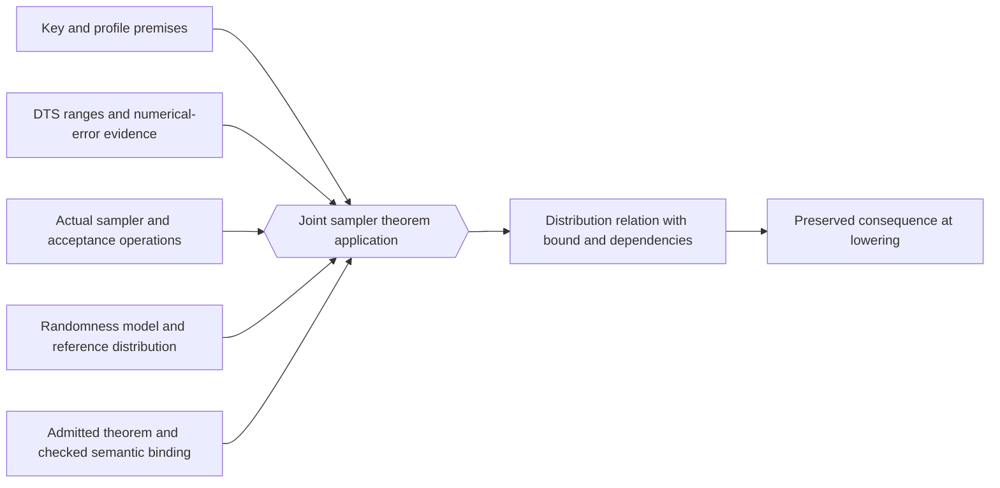

# Clef proof plan

The Clef route is first-party algorithm code with library-owned laws and automatically derived use-site obligations. Application developers continue to write ordinary Clef. They do not have to reproduce F* refinement annotations, supply proof attributes at each call or select a prover.

DTS dimensions and range constraints provide the existing program facts. Under the [CCS/Composer handoff](../../clef/docs/fidelity/phg/Dimensional_Handoff.md), CCS derives them during saturation and records them on the PSG. Composer reads the graph for lowering. The [DTS application to Falcon](numeric-selection-and-falcon.md#existing-dts-foundation) connects this division to deferred inference and the typed probabilistic design.

This is an implementation plan following Composer's [proof-composition design](../../Composer/docs/Proof_Composition_Architecture.md). General theorem-package admission, quotation bindings and broad relational automation remain engineering work. The existing [Lattice integration record](../../Composer/docs/Lattice_Integration.md) defines the narrower implemented baseline.

## Reuse boundary

For each selected reference operation, preserve three objects: its algorithm specification, its executable implementation and the statement proved about it. Record the preconditions and observation model as well as its result. The Clef implementation needs a semantic relation to the chosen specification.

Two paths are useful. A reference provider can be bound and exercised under its external contract. A native port can reconstruct the algorithm and discharge obligations through Clef's machinery. The first path supports comparison and bring-up. The second establishes first-party implementation evidence.

F*, EasyCrypt or SAW proof results require a checked bridge before they can justify a Clef operation. Until that bridge exists, they are reference evidence. A practical initial route is to reconstruct selected mathematical lemmas in the managed Rocq environment and register their meaning for compiler-owned operations.

## Four tiers

| Tier | Crypto obligation | Proposed evidence path |
| --- | --- | --- |
| 1: structural | Numeric kinds, key purposes and supported resource relationships | Existing admitted structural rules |
| 2: local | Carrier ranges, valid shifts, layout, array access and local error conditions | Sound analysis and cvc5 in the supported theory |
| 3: domain laws | Modular-reduction identities, transform invariants, numerical-error composition and admitted sampling/termination lemmas | Registered parameterized laws with checked premises |
| 4: relational | Implementation/lowering correspondence, leakage relations and probabilistic execution relations | Admitted cRHL/pRHL derivations and their checked Rocq foundations |

The tier describes the reasoning role. A Tier 3 law proved in Rocq retains that dependency. Arithmetic leaves checked by cvc5 do not erase its foundation. This follows the current September 2026 composition design, which supersedes a fixed tool assignment based only on tier number.

cRHL needs a specified relation between the source operation and its realization, including observable errors and effects. Functional equality alone does not establish secret-independent behavior. A leakage judgment compares admitted executions under the selected observation model. pRHL needs the actual distributions and relation, with quantitative bounds where the argument requires them. Computational security also needs its adversary and hardness assumptions.

## Quotation and theorem records

A library author can provide a typed proof quotation or register an existing Rocq theorem through a checked semantic binding. The quotation interface is still a design sketch in [Numeric Selection §4](../../clef-lang-spec/spec/numeric-selection.md). Use the following record requirements before selecting concrete syntax:

- The law's stable identity, parameters, proposition and applicable operation semantics.
- Its input, output and resource participants, including representation and scale where relevant.
- Its premises, accepted proof or rule derivation, and permitted foundational assumptions.
- The checking dependencies and correspondence between the theorem's model and the PSG.
- The conditions under which changes to code, representation, target facts or dependencies invalidate an instance.

The compiler matches an admitted operation, substitutes the actual participants and derives the premises. It records the result in the PSG and displays it through Clef Proofs. A quotation's presence is not a proof of its proposition. Unsupported or unproved premises remain visible and prevent commitment where required.

Secret classification can originate at the key and randomness APIs and propagate through dataflow. A private scalar does not become public merely because a helper receives it. Source-level annotations are not the mechanism for silently authorizing declassification.

## Proof applications as joint constraints

[A Triangle Without Mystery](../../clef-lang-site/hugo/content/blog/a-triangle-without-mystery.md) describes the required relationship: retain the full joint constraint, the identities of its participants and the premises used to establish it. The [Program Hypergraph](../../clef-lang-spec/spec/program-hypergraph.md) provides that structure. A cryptographic theorem application belongs in this graph, together with the values and operations it justifies.

For a Falcon sampling law, its joint participants would include the admitted key/profile, numerical operations and their error evidence, sampler parameters, randomness model, acceptance rule and reference distribution. The law's conclusion identifies the resulting distribution relation and its quantitative bound. Lowering correspondence connects that operation to the emitted realization. This is a proposed law application within the existing architecture, without prescribing a new public source syntax.

Separate reasoning procedures can check the law's dimensional, arithmetic and probabilistic premises. Their results must refer to the same participants and compatible assumptions when the joint application is discharged. A numerical proof for one key profile cannot justify a sampler instantiated with another. A bound for one scale cannot be substituted at a different rounding boundary merely because both values share a numeric carrier.

The compiler should retain these dependencies in the canonical graph. A changed scale, guard, key constraint or sampler implementation invalidates the affected application. A temporary external ledger can cross-check this mechanism, as the blog describes, but it cannot become an independent source of semantic facts.

At emission, Composer consumes the established consequences as node-local codata or deliberately reified annotations, following the PHG's emission contract. It does not rediscover the joint relationship by traversing hyperedges in a code-generation witness. Evidence required at a later boundary must still identify the corresponding participants and accepted preservation route.

Enumerating the participants makes the obligation's incidence explicit. The admitted rule and logical fragment determine how it can be checked. A finite source set alone does not turn a probabilistic security theorem into a decidable arithmetic query.

## First proof slice

Begin with a scalar modular-reduction kernel for ML-KEM. Its modulus is fixed by the suite. As a small illustrative obligation, inputs already established in `[0, q-1]` have sum `s` in `[0, 2q-2]`. Conditional subtraction of `q` produces a canonical representative in `[0, q-1]` with the same residue. This is a proof target, not an implemented Clef API or a claim about a reference's signed representation.

The compiler must establish the input bounds from checked producers and preserve the widened sum. The library law justifies residue preservation. The realization must implement the selection with the admitted secret-independent operations. A branchless source expression needs a corresponding target-level argument after lowering.

Acceptance includes a negative example with an unestablished input bound, one with an insufficient intermediate carrier and one with a secret-dependent branch. The correct case needs the full source-to-emitted-operation evidence path. This provides a bounded test of quotation admission, automatic premise generation and cRHL preservation.

Extend that path to the actual signed/centered modular kernels, then NTT operations and serialization. A complete ML-KEM operation additionally needs its hash, sampling and implicit-rejection behavior. ML-DSA reuses admitted kernels only where their meanings agree.

## Numerical and probabilistic extension

For Falcon, admit separate laws for numerical capacity, approximation error and sampling behavior. The [numeric-selection plan](numeric-selection-and-falcon.md) supplies the worked error contract. Almost-sure termination of a sampler is different from a fixed execution-time bound. An implementation must preserve its required distribution even when execution is partitioned or suspended.

Use a small distribution-preserving transformation as the first pRHL bridge. Approximate sampling requires the appropriate quantitative relation and a checked security argument. A generic equality coupling cannot stand in for a divergence bound.

## Compiler and device realization

For each lowering, use an accepted preservation theorem or re-check the emitted realization against its source contract. Bind the evidence to the source/PSG snapshot, compiler configuration and artifact digest. Cache invalidation includes target arithmetic modes and provider revision.

A hardware provider supplies an operation contract backed by its declared device premises and tests. Driver ownership, MMIO transitions and completion still require their own reasoning. An opaque device's internal arithmetic does not become a Rocq-proved implementation through an adapter declaration.
