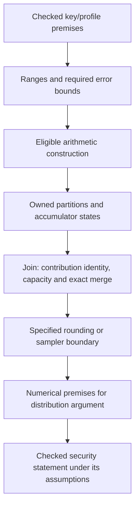

# Numeric selection, accumulation and Falcon

Clef's opportunity is to derive cryptographic arithmetic from checked range and precision obligations, then preserve those obligations through construction and placement. A first-party Falcon implementation can be a demanding application of that design.

This proposal follows [Numeric Selection](../../clef-lang-spec/spec/numeric-selection.md), [Arithmetic Construction and Placement](../../clef-lang-site/hugo/content/docs/internals/numerics/arithmetic-construction-and-placement.md), [Pondering Fearless Parallelism](../../clef-lang-site/hugo/content/blog/pondering-fearless-parallelism.md) and [Weaving the Braid](../../clef-lang-site/hugo/content/blog/weaving-the-braid.md). Those documents distinguish representation, arithmetic construction and execution placement. The cryptographic application needs all three.

## Existing DTS foundation

[The Gift of Deferred Inference](../../clef-lang-site/hugo/content/blog/deferred-inference.md) supplies the compilation discipline: retain dimensional identity and justified range constraints while representation remains open, then settle the choice when its required context is available. [Beyond the Bitter Lesson: Structural Convergence](../../clef-lang-site/hugo/content/blog/beyond-the-bitter-lesson-structural-convergence.md#the-probabilistic-stratum) develops the broader design in which distributions participate in that typed structure. Fidelity.Cryptography should use these foundations for cryptographic arithmetic and sampling contracts.

The existing [Width Inference specification](../../clef-lang-spec/spec/width-inference.md) already requires branch-sensitive ranges, retained relational guards and dependency tracking through deferred demand. For unchanged integer values, a guard such as `count <= length - offset` remains usable as `offset + count <= length`. The integer-affine requirement is stronger than keeping independent intervals. The same preservation rule matters when a sampling condition establishes a relationship between parameters.

The inspected [CCS range implementation](../../clef/src/Compiler/PSGSaturation/SemanticGraph/RangeAnalysis.fs) contains per-node integer ranges, guard refinements, fixed-point iteration with widening/narrowing, and field/element range joins. That is an existing implementation foundation. Its presence does not establish complete coverage of the normative relational rules or real-valued sampler error analysis.

The [dimensional handoff](../../clef/docs/fidelity/phg/Dimensional_Handoff.md) assigns program-fact inference to CCS saturation. Facts and their evidence are recorded on the PSG. Composer consumes that graph when realizing target operations. New cryptographic range or error facts therefore belong in the relevant CCS analysis and admitted law applications. They must not be independently recomputed in a Composer witness or maintained in a parallel cryptography ledger.

| Existing structure | Cryptographic use |
| --- | --- |
| Dimensional identity | Check parameter, error and normalization expressions for compatible quantities |
| Ranges and relational guards | Establish intermediate capacity, admissible key/profile constraints and branch-specific premises |
| Deferred inference | Keep a consistent obligation pending until the law, input context and target declarations determine a checked choice |
| Representation and construction evidence | Select covering arithmetic and establish its rounding, rescaling and accumulation contract |
| Typed probabilistic design | Describe the reference and implemented samplers with their support, probability law and admitted composition rules |
| PSG evidence and lowering correspondence | Preserve the same participants and premises through placement and emitted operations |

For example, a Gaussian parameterization requires its center and standard deviation to use the same quantity scale, its variance to use the squared scale, and its normalized displacement to be dimensionless. An absolute numerical-error bound has the quantity's dimension. Probability and Rényi divergence are dimensionless but remain distinct semantic quantities. Dimensional equality alone cannot authorize substituting one for the other. These checks can be inferred from library operation contracts without asking application authors to annotate each intermediate value.

A support bound states where a random value can occur. A probability law states how mass is assigned within that support. The probabilistic design can retain both within the same typed framework, with the appropriate judgment for each. A point interval is a range fact, while a Dirac distribution is a probability law concentrated at a point. A hard admissible set also leaves many possible probability laws within it. The sampler contract supplies the particular law needed by the security theorem.

This extends the existing architecture with domain laws for approximation and probability. It does not require a separate application-facing interval system or a new refinement-annotation discipline. The first implementation experiment should identify which DTS facts already discharge its premises and which numerical or probabilistic laws still need admission.

[A Triangle Without Mystery](../../clef-lang-site/hugo/content/blog/a-triangle-without-mystery.md) establishes how those laws compose: their applications are joint constraints with identified participants in the hypergraph. The [proof plan](clef-proof-plan.md#proof-applications-as-joint-constraints) connects the numerical and probabilistic premises of one sampler application. This preserves relationships that independent per-value bounds cannot express.

## Research opening

The abstract of [Toward a Secure Fixed-Point Implementation of the Falcon Signature Scheme](https://eprint.iacr.org/2026/1531) states that its security theorem is conditional on intermediate error bounds whose supporting precision analysis remains partly empirical. It also describes modified key generation used to establish variable bounds. These are different claims: numerical capacity and the precision needed for the security argument.

The proposed Fidelity contribution is to turn selected precision premises into checked bounds for the actual arithmetic graph. Success would require an admitted numerical theorem and a checked connection to the relevant cryptographic theorem. This is a research objective, not an existing proof or a prediction that every bound will be tractable.

The reviewed material includes the paper abstract, the authors' [slides](https://tprest.github.io/pdf/slides/fixed-point-falcon-apqc-2026.pdf) and the artifact documentation. The full paper PDF could not be retrieved during this review. Exact theorem hypotheses and constants must be checked against that text before theorem admission.

## Representation eligibility

Numeric selection minimizes its declared representation-error metric among covering, permitted candidates. Cryptographic eligibility adds the operation's exactness, approximation and leakage requirements. Passing a range check alone does not satisfy those requirements.

ML-KEM and ML-DSA modular kernels retain exact integer semantics. Their carriers can be inferred from proved intermediate ranges, while their wire encodings remain fixed. Floating-point or posit approximation is not an interchangeable implementation of those residue operations.

Falcon's numerical regions admit a different investigation. Start with the selected fixed-point research variant and its specified scales, rounding and key filters. A posit/quire construction can then be compared under a declared numerical and distribution contract. A lower representation-error score alone cannot authorize a new signer.

Selection remains static for the admitted public profile. Secret-dependent representation dispatch, variable-width arithmetic or early termination could disclose information even when each result is numerically correct. Any key-specific numerical preparation needs an explicit leakage and custody analysis.

## Error accumulation

For each numerical region, extend the existing PSG facts with the relation to its reference quantity and the justified error bound. Reuse its dimensional identity, enclosure and selected representation, recording scale and rounding provenance where the construction requires them. These are compiler/library facts, without application-level refinement annotations.

Consider a permitted exact dot-product construction. Let the represented inputs be `â_i`, `b̂_i`, and let their reference values be `a_i`, `b_i`. Assume:

\[
|\hat a_i-a_i|\le\alpha_i,\qquad
|\hat b_i-b_i|\le\beta_i.
\]

If an adequate accumulator forms the products of the represented inputs exactly, merges them exactly, and rounds only at finalization with error at most `rho`, then:

\[
\left|\widehat S-\sum_i a_i b_i\right|
\le
\rho+\sum_i\left(|a_i|\beta_i+|b_i|\alpha_i+\alpha_i\beta_i\right).
\]

This is a proposed elementary library law, obtained by expanding the perturbed product and applying the triangle inequality. It has not been mechanized here. A construction with rounded product formation adds the corresponding product-error terms. Correlation-sensitive analysis may establish a tighter bound, while retaining a sound enclosure.

An eligible quire eliminates accumulation rounding from this expression. It preserves the exact sum of represented products within its proved capacity. It does not remove input errors, approximate constants or error introduced at earlier nonlinear operations. An integer superaccumulator or a verified expansion can supply another eligible construction where the target and proof requirements permit it.

For fixed point, each rescaling contributes either an exact divisibility fact or a bounded rounding term. Reciprocal and square-root operations need domain and conditioning bounds as well as range coverage. The Falcon task is to propagate those facts to the particular intermediate values required by its sampling argument.

## The braid and the return boundary

At a parallel split, each worker receives an identified contribution set and the same admitted numerical contract. At the join, the computation must establish that each required contribution was accepted with the intended multiplicity and representation. An exact merge combines accumulator states before the permitted final rounding.

The accumulator proof needs capacity for every permitted partial sum and merge. The ownership proof needs live buffers and safe publication. The protocol proof needs correct job/partition identities through retry or resumption. The same PSG participants connect these judgments.

Randomness is another owned dependency. Reordering deterministic arithmetic may preserve a result while reassigning random draws changes the sampler. A transformation must preserve the specified draw discipline or establish the required probabilistic relation. Completion order must not select the first successful secret-dependent result without an argument about the resulting distribution and observations.

The braid makes these boundaries explicit. Its algebraic laws justify only the observations covered by their semantic interpretation. A secret-sharing or distributed-signing protocol would require additional cryptographic design beyond ordinary placement of a computation.

## Branches, sampling and rejection

CCS's path-sensitive analysis can refine a numerical state under a branch predicate. On an accepted path, it can use the established acceptance condition. On a rejected path, it can use the complementary condition. These are static judgments about possible executions. They do not require the deployed signer to maintain interval objects or vary its precision according to secret values.

The predicate belongs to the arithmetic implementation being checked. If an approximate comparison and its mathematical reference can disagree near a threshold, their acceptance states need a relational argument. Assuming that both executions take the same branch would omit the very error that the proof must bound.

A join combines the reachable states. A single interval hull is a sound overapproximation when its transfer rules are sound, but it can lose disjunctions and correlations needed for a useful precision bound. The analysis may need symbolic relations, retained path partitions or a library theorem. Rejection loops require inductive invariants and a termination or tail argument. Enumerating a fixed number of iterations does not establish the behavior of an unbounded sampler. Adding a retry limit changes its observable failure behavior and needs its own analysis.

A quire applies to an eligible sum of represented products within capacity. Polynomial transforms and recursive tree operations can contain several such regions, with rounding, division, rescaling or other operations between them. A fixed-size quire cannot be assumed to absorb the whole computation. Moving a rounding boundary changes the numerical program unless the governing contract permits that construction.

For the sampler, a bound on possible output values is insufficient. Two distributions can both have support `{0, 1}` while assigning very different probabilities to those values. The required proof must relate the output probabilities, including the effects of approximate parameters and accept/reject decisions. Conditioning on acceptance also changes normalization, so an error bound before rejection does not automatically hold for the returned sample.

The fixed-point paper uses a Rényi-divergence argument. The Clef theorem package must establish its actual numerical premises and connect them to the required probabilistic bound. A uniform pointwise error bound might suffice for a particular moment bound, but that implication and its constants need a proof. Ordinary intervals contain neither probability mass nor a divergence bound. The sampler's entropy model, rejection behavior and any exceptional-event probability remain explicit premises.

The reference distribution must be the one specified by that theorem. Falcon samples discrete lattice objects and emits encoded signatures. A discrete output distribution and a continuous distribution over the same real space are mutually singular: the discrete support has probability one under one and zero under the other. Their total variation distance is therefore maximal. A continuous Gaussian may participate in the mathematical construction, but a comparison to actual samples needs the specified discretization or other mapping. Statistical distance and Rényi divergence also need their own definitions and any proved conversion used in the security argument.

An arithmetic approximation affects the parameters and acceptance probabilities of the implemented sampler. A bound on that effect must retain any dependence on the key and the number of signing queries. Failure to establish the required bound leaves the security argument incomplete. It does not by itself demonstrate exploitable leakage, just as small numerical error alone does not establish security.

Library authors supply numerical and cryptographic theorems with checked semantic bindings. CCS derives the applicable program facts and obligations, and the proof service checks the admitted derivations. Composer consumes the resulting evidence and must preserve or re-check the required properties through lowering. The binding must preserve the reference distribution, error metric and security assumptions. An asserted implication from a maximum interval to a safe distribution is insufficient. This division allows the compiler to apply cryptographic results without independently discovering them.

Composer's current [proof-composition architecture](../../Composer/docs/Proof_Composition_Architecture.md) uses cvc5 alongside checked law admission and Rocq foundations. SMT-LIB2 is a query format, not evidence that Z3 is the selected solver or that an arbitrary nonlinear or probabilistic obligation is decidable. Local arithmetic queries can discharge supported premises. Numerical and distribution theorems require their admitted derivations, and any solver evidence used inside them needs the accepted checking interface.

The braid provides a common representation for Clef's control, data and placement relationships. Path-sensitive numerical reasoning is also possible over other control/data representations. Its value here is the connection to the same operand identities, ownership facts and lowering decisions used by Composer. Proving precision at source still requires preservation through the selected realization, followed by a separate leakage argument for that realization.

## Four-tier application

Tier 1 supplies admitted structural facts about values and resources. Tier 2 checks local capacity and representability conditions. Tier 3 instantiates numerical-error and accumulator laws with the actual operands and partitions. Tier 4 supplies cRHL preservation between constructions and their realizations, plus the admitted pRHL or quantitative relational argument for sampling changes.

The target is one connected derivation: the error bound at a sampler boundary must concern the same key profile, arithmetic realization and execution represented by the cryptographic theorem. A correct proof about a different rounding sequence cannot justify the selected signer.

## Bounded experiment

1. Pin the fixed-point variant and reference artifacts. Identify one named numerical premise from the full paper, with its admissible key set and precise metric.
2. Implement and prove one bounded arithmetic region in Clef, including constants, rescaling and any nonlinear operations in that region.
3. Establish its error bound against an independent high-precision model and a mathematical argument. Measurements check the implementation but do not replace the bound.
4. Compare fixed point with an eligible exact-accumulation construction. Preserve the original contract where possible, and record any changed rounding semantics requiring a new theorem.
5. Exercise permitted partitions, transfers and joins on one native target. Check emitted arithmetic and the chosen leakage model separately.
6. Connect the established bound to the chosen sampling theorem. Extend to the remaining premises before making an end-to-end signer claim.

This experiment runs alongside standardized ML-KEM/ML-DSA implementation and the AES provider work. It has its own evidence milestones, without making the rest of Fidelity.Cryptography wait for a complete Falcon proof.
