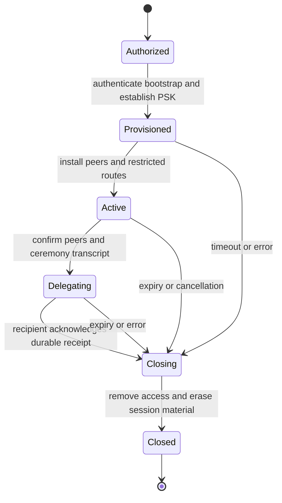

# WireGuard and hybrid keys

KeyStation has two WireGuard uses: a short-lived network for a delegated key ceremony, and a persistent network overlay. Both use the protocol's existing preshared-key input, with application policy governing bootstrap, lifetime and rotation.

The [SpeakEZ WireGuard post](<../../SpeakEZ/hugo/content/blog/Quantum WireGuard with PSKs.md>) supplies the product intent. The cryptographic implementation follows the actual [WireGuard protocol](https://www.wireguard.com/protocol/), including its Noise handshake. Its PSK is 32 bytes. Its transport uses ChaCha20-Poly1305, so the MBS AES-256 policy does not change WireGuard's cipher suite.

## Bootstrap

The selected profile must define how both peers obtain an authenticated, confidential PSK before transmitting credential material. Two paths are in scope:

- KeyStation generates a fresh PSK and provisions it through an authenticated confidential secondary channel.
- An independently authenticated PQ establishment protocol derives a PSK, binding the recipient, ceremony and WireGuard peer keys to its transcript. The protocol and combiner must be specified and reviewed before implementation.

The second path needs an existing authentication anchor. ML-KEM by itself supplies no peer authentication. Transferring the first secret over a classically secured tunnel does not retroactively protect that transfer from a future quantum adversary. A signed QR containing public bootstrap material can authenticate an establishment path, whereas a QR containing a PSK exposes that PSK to anyone who can capture it.

The term hybrid must identify the composition. The basic deployment combines WireGuard's classical exchange with an independently provisioned symmetric PSK. A PQ-established PSK adds a separate establishment protocol. These are different profiles, even though both configure the same WireGuard PSK field. Do not implement an ad hoc concatenation or XOR combiner.

## Ceremony channel

The ceremony profile creates fresh peer key material and a fresh PSK for one authorized delegation. Its lease identifies both participants and the permitted operation. It binds an expiry and replay identifier to the ceremony transcript. A separate application authentication step binds the ceremony to the configured tunnel peers.

The deployment also identifies the tunnel endpoint. A KeyStation console terminating the tunnel is temporarily network-connected. A design retaining an air-gapped custody device instead terminates the tunnel on a companion gateway and defines a separate, bounded ceremony interface to that device. The gateway's compromise and authorization boundaries belong in the selected profile.

The proposed lifecycle is:

Restrict routes and services to the delegation operation. The channel's lease is enforced by the controller at both ends using an explicit time policy. WireGuard does not infer that lease from key bytes. Delegated credentials have their own lifetime, which may exceed the channel lifetime.

Receipt and acknowledgement need durable ceremony state. If an acknowledgement is lost, retrying must not mint an additional credential or duplicate a one-time action. The authority records the issuance decision and reconciles the recipient's receipt using the ceremony identifier.

Teardown removes peer configuration, routes and temporary service authorization. It erases PSKs and ephemeral private keys after outstanding operations finish. A controller restart must recover enough lease state to remove abandoned channels. The audit retains authorization and issuance evidence without retaining session secrets.

A short-lived channel limits the interval for active access. Recorded ciphertext survives teardown. Protection of that recording depends on the establishment and secrecy of the PSK, plus the endpoint and algorithm assumptions. Later compromise of a reused PSK weakens its added protection for recorded sessions, so fresh ceremony keys and erasure are explicit requirements.

## Persistent overlay

The persistent profile needs enrollment, per-peer authorization and a controller for key rotation. It also needs revocation, address/route management and recovery during interrupted updates. Cryptography supplies the key operations. The overlay service owns that control plane.

Separate long-lived identity keys from tunnel PSKs and session state. Pairwise PSKs constrain compromise scope. Rotation must account for the peer's actual configuration behavior and coordinate both endpoints. A controller must not assume simultaneous acceptance of arbitrary PSK generations for one peer.

Admission tests cover bootstrap substitution, replay and expiry. Include one-sided rotation, controller restart and revoked peers. Exercise packet loss around ceremony commit and teardown, then verify that no credential operation remains reachable through an expired channel.

## Cloudflare integration

A product comparable to Cloudflare One/WARP can use this lifecycle model without assuming compatibility with Cloudflare's control plane. Their documented connectivity includes both WireGuard and MASQUE, with different integration requirements. [Cloudflare connectivity](https://developers.cloudflare.com/cloudflare-one/networks/connectivity-options/)

Cloudflare-specific adapters belong with Fidelity.CloudEdge or the consuming overlay service. Identify the exact API, key purpose, tenant permissions and custody boundary before describing an integration as BYOK. For example, AI Gateway's documented BYOK feature stores AI-provider API credentials. It does not establish support for importing this system's WireGuard PSKs or retaining a KeyStation root remotely. [AI Gateway BYOK](https://developers.cloudflare.com/ai-gateway/configuration/bring-your-own-keys/)

Public trust-anchor distribution and remote signing are separate integration profiles. Non-exportable KeyStation roots remain local. Any cloud-held derived key requires an explicit authorization and lifecycle policy.
